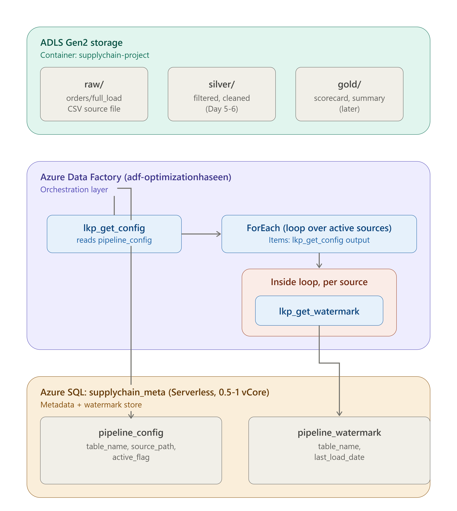

# Architecture — Supply Chain Intelligence Pipeline

## Overview

An end-to-end Azure data pipeline that ingests supply chain order data (DataCo Supply Chain dataset, ~180K records), processes it incrementally using a metadata-driven design, and prepares it for analytics in a medallion (raw/silver/gold) architecture.



---

## Services Used

### 1. ADLS Gen2 (Azure Data Lake Storage Gen2)

**What it is:** Object storage with a hierarchical namespace (real folders, not flat key-prefixes like plain Blob storage).

**Why chosen:** Enables medallion architecture (raw → silver → gold) with true folder structure, which plain Blob storage doesn't support efficiently.

**What we built:**
- Container: `supplychain-project`
- Folders: `raw/orders/full_load/`, `silver/orders/`, `gold/vendor_scorecard/`, `gold/delivery_summary/`
- Source CSV (`DataCoSupplyChainDataset.csv`) uploaded to `raw/orders/full_load/`

---

### 2. Azure Data Factory (ADF)

**What it is:** Cloud-based orchestration service — schedules and chains together activities like data copy, lookups, and transformations.

**Why chosen:** Industry-standard orchestration tool for Azure; integrates natively with ADLS, Azure SQL, and Databricks.

**What we built:**
- `pl_fullload_orders` — Copy Data activity, validates connectivity to source CSV (18s run, single file, no splitting)
- `pl_incremental_orders` — metadata-driven incremental pipeline:
  - `lkp_get_config` — reads list of active source tables from `pipeline_config`
  - `ForEach` — loops over each active source
  - `lkp_get_watermark` (inside loop) — dynamically fetches last-loaded date for the current source from `pipeline_watermark`, using `@item().table_name`

---

### 3. Azure SQL Database — `supplychain_meta`

**What it is:** A small relational database used purely for pipeline metadata/control — not business data.

**Why chosen:** ADF pipelines need persistent state between runs (watermarks, config). Azure SQL Serverless is the cheapest option for this (auto-pauses when idle).

**Cost optimizations applied:**
- Serverless tier, 0.5–1 vCore, auto-pause after 60 min (brought estimated cost from $293/month down to under $5/month)
- Locally-redundant storage (LRS) for backups
- Zone redundancy disabled
- Managed Identity authentication (no stored passwords)

**Tables:**
- `pipeline_config` (table_name, source_path, active_flag) — drives which sources the pipeline processes; adding a new source = one INSERT, no pipeline changes
- `pipeline_watermark` (table_name, last_load_date) — tracks incremental load progress per source table

---

### 4. Databricks (Planned — Day 5/6 onward)

**What it'll do:** PySpark notebook performing the actual data transformation logic that ADF cannot do natively:
- Read raw CSV from ADLS
- Filter rows where `order_date > watermark`
- Fix inconsistent date formats, handle nulls, deduplicate records
- Write cleaned output to `silver/`
- Update the watermark in Azure SQL after successful load

**Why ADF alone isn't enough:** ADF's Copy activity moves data as-is — it cannot filter or transform row content. Any logic requiring reading/evaluating row values needs a compute engine like Databricks/Spark.

---

## Key Concepts

**Linked Service** — a saved connection definition (server address + authentication) to an external system. One linked service can be reused by multiple datasets. Example: `ls_AzureSQL_supplychain_meta` is reused by both `ds_pipeline_config` and `ds_watermark_table`.

**Dataset** — points to a specific table/file within a linked service's connection.

**Lookup activity** — reads a small value or list of rows to use later in the pipeline (e.g., reading the watermark date, or the list of active source tables). Does not move/copy data.

**Copy activity** — moves data as-is from source to destination, no row-level logic.

**ForEach activity** — repeats a set of activities once per item in a list (paired with a Lookup that supplies the list).

**Watermark pattern** — standard incremental load technique. A stored value (`last_load_date`) marks the cutoff point; each run processes only records newer than this value, then updates the watermark to the new max.

---

## Design Decisions & Pivots

1. **Metadata-driven design (Day 3):** Instead of one hardcoded pipeline per source table, built a config table (`pipeline_config`) + ForEach loop. Adding new sources requires zero pipeline changes — just a new config row.

2. **Filtering logic moved to Databricks (Day 2→5 pivot):** Initially assumed ADF Copy could filter CSV rows by date using the watermark. Discovered Copy activity only moves files as-is — it cannot evaluate row content. Redesigned: ADF orchestrates (reads watermark, triggers Databricks), Databricks performs the actual filter/transform logic.

3. **Authentication fix:** Initial ADF→Azure SQL connection failed with `Login failed for user '<token-identified principal>'`. Root cause: ADF's managed identity wasn't registered as a database user. Fixed via:
   ```sql
   CREATE USER [adf-optimizationhaseen] FROM EXTERNAL PROVIDER;
   ALTER ROLE db_datareader ADD MEMBER [adf-optimizationhaseen];
   ALTER ROLE db_datawriter ADD MEMBER [adf-optimizationhaseen];
   ```

---

## Pipeline Flow (Current State)

```
ADLS raw/orders/full_load/ (CSV)
        |
        v
ADF: lkp_get_config  -->  reads pipeline_config (Azure SQL)
        |
        v
   ForEach (loop per active source)
        |
        v
   lkp_get_watermark  -->  reads pipeline_watermark (Azure SQL)
        |
        v
   [Day 5-6: Databricks notebook reads CSV + watermark,
    filters/cleans, writes to silver/, updates watermark]
```
